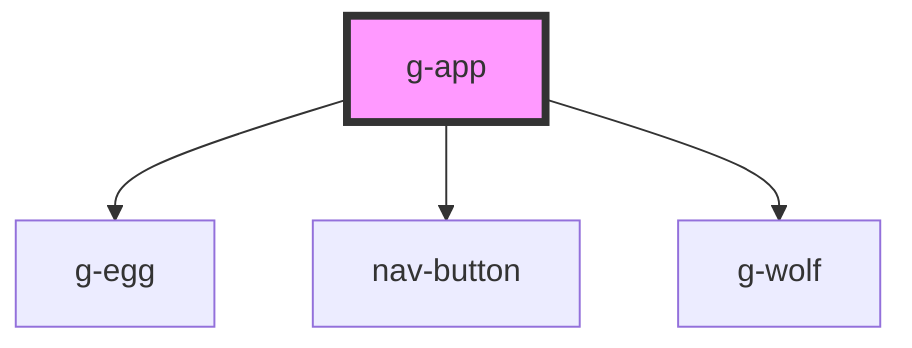

# g-app

<!-- Auto Generated Below -->

## Properties

| Property  | Attribute  | Description | Type      | Default |
| --------- | ---------- | ----------- | --------- | ------- |
| `devMode` | `dev-mode` |             | `boolean` | `false` |

## Events

| Event        | Description  | Type                   |
| ------------ | ------------ | ---------------------- |
| `gameOver`   |              | `CustomEvent<void>`    |
| `gamePaused` | for dev-mode | `CustomEvent<boolean>` |
| `gameWon`    |              | `CustomEvent<void>`    |

## Dependencies

### Depends on

- [g-egg](../egg)
- [nav-button](../button)
- [g-wolf](../wolf)

### Graph

----------------------------------------------

*Built with [StencilJS](https://stenciljs.com/)*
