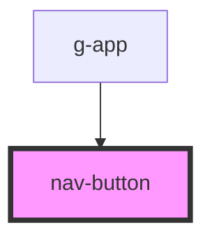

# nav-button

<!-- Auto Generated Below -->

## Properties

| Property    | Attribute   | Description | Type                                                           | Default     |
| ----------- | ----------- | ----------- | -------------------------------------------------------------- | ----------- |
| `direction` | `direction` |             | `"left-bottom" \| "left-top" \| "right-bottom" \| "right-top"` | `undefined` |

## Events

| Event              | Description | Type               |
| ------------------ | ----------- | ------------------ |
| `gChooseDirection` |             | `CustomEvent<any>` |

## Dependencies

### Used by

 - [g-app](../app)

### Graph

----------------------------------------------

*Built with [StencilJS](https://stenciljs.com/)*
