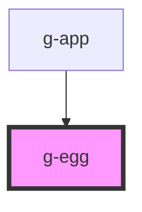

# g-egg

<!-- Auto Generated Below -->

## Properties

| Property          | Attribute           | Description | Type                                                           | Default     |
| ----------------- | ------------------- | ----------- | -------------------------------------------------------------- | ----------- |
| `eggMoveDuration` | `egg-move-duration` |             | `number`                                                       | `1000`      |
| `nest`            | `nest`              |             | `number`                                                       | `undefined` |
| `wolfPosition`    | `wolf-position`     |             | `"left-bottom" \| "left-top" \| "right-bottom" \| "right-top"` | `undefined` |

## Events

| Event          | Description | Type               |
| -------------- | ----------- | ------------------ |
| `eggIsCathced` |             | `CustomEvent<any>` |

## Dependencies

### Used by

 - [g-app](../app)

### Graph

----------------------------------------------

*Built with [StencilJS](https://stenciljs.com/)*
