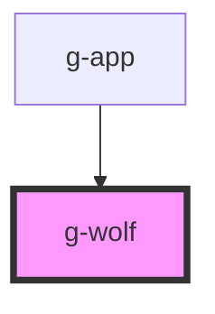

# g-wolf

<!-- Auto Generated Below -->

## Properties

| Property   | Attribute  | Description | Type                                                           | Default      |
| ---------- | ---------- | ----------- | -------------------------------------------------------------- | ------------ |
| `position` | `position` |             | `"left-bottom" \| "left-top" \| "right-bottom" \| "right-top"` | `'left-top'` |

## Events

| Event                 | Description | Type                                                                        |
| --------------------- | ----------- | --------------------------------------------------------------------------- |
| `wolfDirectionChange` |             | `CustomEvent<"left-bottom" \| "left-top" \| "right-bottom" \| "right-top">` |

## Dependencies

### Used by

 - [g-app](../app)

### Graph

----------------------------------------------

*Built with [StencilJS](https://stenciljs.com/)*
